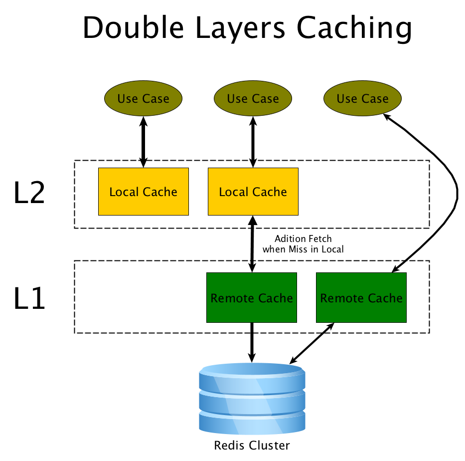

enhanced-data-cache
===

# Quick Start
## Through XML
```xml
<enhanced-cache:init namespace="project-namespace" redis-ref="redisTemplate" use-aspectj="false" />
<context:component-scan base-package="com.yoloho.enhanced.cache" />
<bean id="poolConfig" class="redis.clients.jedis.JedisPoolConfig">
   <property name="maxTotal" value="100"/>
   <property name="maxIdle" value="10"/>
   <property name="testOnBorrow" value="true"/>
</bean>
<bean id="redisConnectionFactory"
     class="org.springframework.data.redis.connection.jedis.JedisConnectionFactory">
   <property name="hostName" value="192.168.123.3"/>
   <property name="port" value="6379"/>
   <property name="poolConfig" ref="poolConfig"/>
</bean>
<bean id="redisTemplate" class="org.springframework.data.redis.core.RedisTemplate">
   <property name="connectionFactory" ref="redisConnectionFactory"/>
   <property name="keySerializer">
		<bean
			class="org.springframework.data.redis.serializer.StringRedisSerializer"></bean>
	</property>
</bean>
```

property | required | comment
--- | --- | ---
namespace | true | namespace is used to separated different projects in same redis storage
redis-ref | false | the `RedisTemplate<String, Object>` bean reference
use-aspectj | false | default to `false`, whether to use aspectj

## Through Annotations
```java
@EnableRedisTemplate(
    templateType = TemplateType.BOTH,
    host = "127.0.0.1",
    port = "6379",
    maxTotal = "100"
)
@InitCache(
    namespace = "demo-namespace"
)
```

And you can add another annotation to use `RedisService` over `RedisTemplate`:

```java
@EnableRedisService
```

# Annotation
The main annotations are: 
`@EnableCacheConfig` / `@EnableCache` / `@EnableCacheEvict`

The cache can work in three ways:



`EnableCacheConfig` is used to annotate the target class(eg. implementation of service). It can define the cache configuration for this class.

`EnableCache` is used to annotate a method to enable cache support.

`EnableCacheEvict` is used to annotate a method to evict the specified keys in cache.

## How can it works
### Spring AOP
By default the cache works on spring aop way. It works on `proxy` layer and it means only invocations passing through proxy can be effected. The `internal` invocations in the class can not be captured. eg:

```java
    @EnableCache
    public int getNewValue() {
        return 2;
    }
    
    public int compose() {
        return getNewValue(); // will ignore the cache
    }
```

If it need using the cache the call should pass through proxy:

```java
	@Autowired
	private DemoService demoService; // Circularly referenced
	
    @EnableCache
    public int getNewValue() {
        return 2;
    }
    
    public int compose() {
        return demoService.getNewValue();
    }
```
And cache by cache can work standalone:

```java
    @EnableCache
    public int getNewValue() {
        return 2;
    }
    
    @EnableCache
    public int compose() {
        return demoService.getNewValue();
    }
```

### AspectJ
When you are not satisfied on spring AOP, or you must need the feature that `internal` invocations should also support the cache(whatever it's `public` nor `private`). You may turn to `AspectJ` way.

4 steps you will follow:

#### Dependency
aspectjweaver.jar >= 1.6.3

#### -javaagent
Add the parameter into the jvm startup command. eg.:

```shell
-javaagent:lib/aspectjweaver-1.9.2.jar
```

#### XML / Annotation

```xml
<enhanced-cache:init 
	namespace="test1" 
	redis-ref="redisTemplate" 
	use-aspectj="true" />
```

or

```java
@InitCache(
        namespace = "demo-namespace", 
        useAspectJ = true)
```

#### aop.xml
Create the file `aop.xml` in META-INF as `META-INF/aop.xml`:

```xml
<!DOCTYPE aspectj PUBLIC
        "-//AspectJ//DTD//EN" "http://www.eclipse.org/aspectj/dtd/aspectj1.dtd">
<aspectj>
    <weaver>
        <include within="com.package..*" /><!--You package to be processed-->
    </weaver>
</aspectj>
```

## Tips for Practice
* The type returned by method must be `Serializable`
* Type returned is better to be simple standalone POJO. If you use a class defined in a parent class or extends another class they are all required to be serializable and the serialized result maybe large.

For example, it's not recommended below:

```java
public class Demo {
	public static class ReturnedBean implements Serializable {
	}
}
```

## Example

```java
package com.yoloho.enhanced.cache;

import java.io.Serializable;

public class Item implements Serializable {
    private static final long serialVersionUID = 1L;
    private int id = 0;
    private String name = "test";
    public int getId() {
        return id;
    }
    public void setId(int id) {
        this.id = id;
    }
    public String getName() {
        return name;
    }
    public void setName(String name) {
        this.name = name;
    }
}
```

```java
package com.yoloho.enhanced.cache;

import java.util.List;

import org.springframework.beans.factory.annotation.Autowired;
import org.springframework.stereotype.Service;

import com.google.common.collect.Lists;
import com.yoloho.enhanced.cache.annotation.EnableCache;
import com.yoloho.enhanced.cache.annotation.EnableCacheBoolean;
import com.yoloho.enhanced.cache.annotation.EnableCacheConfig;

@Service
@EnableCacheConfig(group = "newgroup", expire = 77, local = EnableCacheBoolean.ENABLE, remote = EnableCacheBoolean.ENABLE)
public class DemoService {
    @Autowired
    private DemoService demoService;
    
    @EnableCache(group = "other", remote = EnableCacheBoolean.ENABLE, local = EnableCacheBoolean.ENABLE, expire = 60)
    public String getValue() {
        return null;
    }
    
    @EnableCache(expire = 44)
    public int getNewValue() {
        return 2;
    }
    
    @EnableCache(key = "'val_' + #n")
    public int getNewValue(int n) {
        return 2 * n;
    }
    
    @EnableCache
    public int compose() {
        return demoService.getNewValue();
    }
    
    @EnableCache
    public List<Item> array() {
        return Lists.newArrayList(new Item(), new Item(), new Item(), new Item());
    }
    
    @EnableCacheEvict(group = {"newgroup", "other"}, key = {"'val_' + #n"})
    public void update(int n) {
        //nothing
        logger.info("update: {}", n);
    }
}

```


